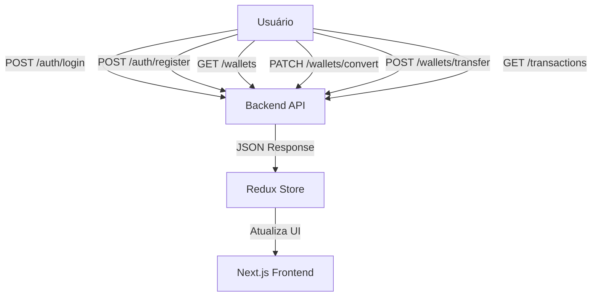

# 📄 BankOp — Your Bank of Operations & Points

O **BankOp** é uma aplicação web moderna para gerenciamento de operações financeiras e pontos, permitindo **conversões** e **transferências** entre usuários.  
A solução foi desenvolvida com **Next.js + Redux Toolkit** no front-end e **NestJS + Prisma** no back-end, priorizando **arquitetura limpa**, **tipagem forte** e **experiência de usuário fluida**.

---

## 📌 Funcionalidades

- Cadastro e autenticação de usuários (`/auth/register`, `/auth/login`)
- Consulta de carteiras e saldos (`/wallets`)
- Conversão de pontos para outras moedas (`/wallets/convert`)
- Transferência de valores entre usuários (`/wallets/transfer`)
- Histórico de transações (`/transactions`)
- Interface responsiva com **Chakra UI**
- Estado global com **Redux Toolkit**

---

## 🏗 Arquitetura da Solução

A aplicação é dividida em:

- **Front-end (Next.js 14 + TypeScript)** — Interface e lógica de interação
- **Back-end (NestJS)** — Autenticação, lógica de negócio e persistência
- **Redux Toolkit** — Estado global e sincronização de dados
- **JWT Auth Guard** — Proteção das rotas no back-end

---

## 📊 Diagrama de Arquitetura


---

## 🔧 Como Executar o Projeto

### Pré-requisitos
- Node.js 18+
- Npm 10+

```bash
git clone [repositório]
cd bankop-frontend
npm install
```
### Ambiente de Desenvolvimento
```bash
npm run dev
```
Acesse: [http://localhost:3000](http://localhost:3000)

---

## 💡 Decisões Técnicas

- Next.js App Router: Adoção para suporte a Server Components e melhor performance
- Tailwind + Chakra UI: Combinação para produtividade e consistência visual
- Context API: Escolha simplificada para gerenciamento de estado (evitando Redux)
- React Hook Form: Solução performática para formulários complexos
- Static Typing: TypeScript em toda a aplicação para maior confiabilidade

---

## License

[MIT](https://choosealicense.com/licenses/mit/)
