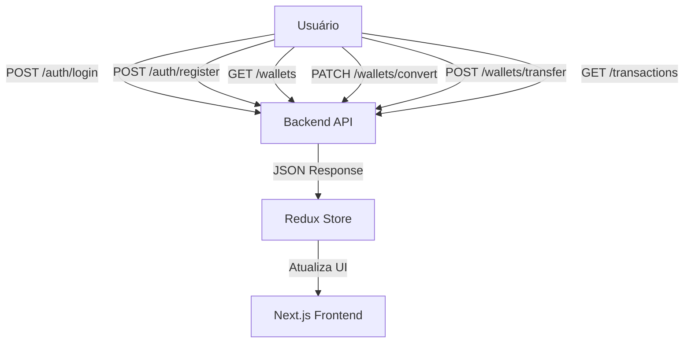

# 📄 BankOp — Your Bank of Operations & Points

O **BankOp** é uma aplicação web moderna para gerenciamento de operações financeiras e pontos, permitindo **conversões** e **transferências** entre usuários.  
A solução foi desenvolvida com **Next.js + Redux Toolkit** no front-end e **NestJS + Prisma** no back-end, priorizando **arquitetura limpa**, **tipagem forte** e **experiência de usuário fluida**.

---

## 📌 Funcionalidades

- Cadastro e autenticação de usuários (`/auth/register`, `/auth/login`)
- Consulta de carteiras e saldos (`/wallets`)
- Conversão de pontos para outras moedas (`/wallets/convert`)
- Transferência de valores entre usuários (`/wallets/transfer`)
- Histórico de transações (`/transactions`)
- Interface responsiva com **Chakra UI**
- Estado global com **Redux Toolkit**

---

## 🏗 Arquitetura da Solução

A aplicação é dividida em:

- **Front-end (Next.js 14 + TypeScript)** — Interface e lógica de interação
- **Back-end (NestJS + Prisma)** — Autenticação, lógica de negócio e persistência
- **Redux Toolkit** — Estado global e sincronização de dados
- **JWT Auth Guard** — Proteção das rotas no back-end

---

## 📊 Diagrama de Arquitetura


---

## 🔧 Como Executar o Projeto

### 🖥 Online (Recomendado)

Acesse a versão hospedada:
 
🔗 Front-end: https://bankop-front.vercel.app

🔗 Back-end: https://bankop-back.onrender.com


### 💻 Localmente

#### Pré-requisitos
- Node.js 18+
- Npm 10+

```bash
git clone https://github.com/robson-artcode/bankop-front.git
cd bankop-front
npm install
```

### Variáveis de Ambiente
#### Adicione um arquivo .env na raiz do projeto com uma das seguintes configurações:
```
# URL base da API Local (ajuste conforme necessário)
NEXT_PUBLIC_API_URL=http://localhost:3333
```
```
# URL base da API Servidor (ajuste conforme necessário)
NEXT_PUBLIC_API_URL=https://bankop-back.onrender.com
```
Caso queira executar o back-end que **já está online** na render, escolha a última. Caso queira instalar o back-end no seu local e prosseguir, entre no link do projeto back-end a seguir:

https://github.com/robson-artcode/bankop-back

### Ambiente de Desenvolvimento
Execute no mesmo terminal da pasta do projeto: 
```bash
npm run dev
```
Acesse: [http://localhost:3000](http://localhost:3000)

---
## 📖 Guia Rápido

### Início 


### 1️⃣ Cadastro
Ao se registrar, você recebe 5.000 OpCoins (promoção).

Conversão: 5 OpCoins = 1 Real.

### 2️⃣ Contas de teste

```bash
Usuário: testebankop1@gmail.com
Senha: 123456
```
```bash
Usuário: testebankop2@gmail.com
Senha: 123456
```

### 3️⃣ Funcionalidades do Painel Principal

Conversão de Pontos: Troque OpCoins por Reais.

Transferência: Envie OpCoins ou Reais para outros usuários.

Histórico: Veja todas as transações feitas e recebidas.


## 💡 Decisões Técnicas

- Next.js App Router: Adoção para suporte a Server Components, roteamento simplificado e melhor performance com Streaming SSR
- Chakra UI + Framer Motion: Kit completo para UI consistente com acessibilidade nativa e animações fluidas
- Redux Toolkit: Solução padrão para gerenciamento de estado global (com RTK Query para APIs) – substitui Context API para casos complexos
- React Hook Form: Integração otimizada para formulários (performance + validação) com suporte a TypeScript
- Static Typing: TypeScript em toda a aplicação para autocompletar inteligente e prevenção de bugs
- ESLint/Prettier: Configuração compartilhada para consistência de código

---

## License

[MIT](https://choosealicense.com/licenses/mit/)
